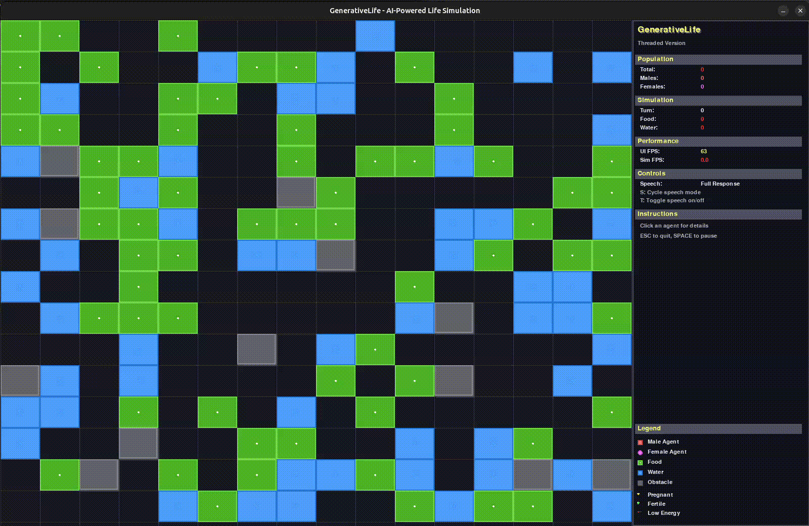

# GenerativeLife: LLM-Powered Agent Simulation

GenerativeLife is an advanced artificial life simulation platform where AI agents, powered by Large Language Models (LLMs), think, learn, and evolve in a dynamic, resource-rich world. Each agent is equipped with a unique personality and decision-making process, enabling emergent behaviors such as cooperation, competition, and adaptation. The simulation supports rich agent interactions, compound actions, and automatic collection of training data for further AI research and model fine-tuning.

<p align="center">
  
</p>

Key features include:

- LLM-powered agents capable of contextual reasoning and multi-step planning
- Multiple personality archetypes (cautious, aggressive, social, etc.)
- Dynamic environment with food, water, obstacles, and agent-to-agent interactions
- Compound action sequences for efficient resource management
- Automatic training data collection for LLM fine-tuning and behavioral analysis
- Robust error handling and modular, extensible architecture

GenerativeLife is ideal for researchers, developers, and enthusiasts interested in artificial life, emergent intelligence, and AI safety/alignment studies. The project is open source and designed for easy extension and experimentation.

> **Advanced artificial life simulation where AI agents think, learn, and evolve using Large Language Models**

[](https://opensource.org/licenses/MIT)
[](https://www.python.org/downloads/)
[]()

- **Documentation**: [docs/](docs/)
- **Examples**: Check the `data/sessions/` directory for simulation examples
- **Issues**: [GitHub Issues](https://github.com/dexmac221/GenerativeLife/issues)

---

**⭐ Star this repository if you find it useful for your research or projects!**

_Building the future of AI agent simulation, one decision at a time._

## 🚀 **Key Features**

- **🧠 LLM-Powered Agents**: Intelligent agents that reason and make decisions using language models
- **🎭 Rich Personalities**: Multiple distinct behavioral archetypes (cautious, aggressive, social, etc.)
- **⚡ Compound Actions**: Multi-step action sequences like `MOVE_UP,PICKUP,EAT,DRINK`
- **� Training Data Collection**: Automatic generation of decision datasets for model fine-tuning
- **�️ Robust Error Handling**: Safe and stable simulation with comprehensive fallback systems
- **🌍 Dynamic Environment**: Resource-rich world with obstacles, food, water, and agent interactions

## 📊 **Agent Behavior Analysis**

Recent simulation data shows interesting behavioral patterns:

- **Movement Patterns**: Agents show strong directional preferences (UP: 32%, DOWN: 31%)
- **Resource Efficiency**: 11% of actions are compound sequences for optimal resource collection
- **Gender Balance**: Nearly equal male/female agent distribution (51%/49%)
- **Energy Management**: Agents successfully balance energy, hunger, and thirst levels

## ⚡ **Quick Start**

### **Prerequisites**

```bash
Python 3.11+
pip or conda for package management
Ollama (for local LLM) or OpenAI API key
```

### **Installation**

```bash
# Clone the repository
git clone https://github.com/dexmac221/GenerativeLife.git
cd GenerativeLife

# Create virtual environment
python -m venv venv
source venv/bin/activate  # On Windows: venv\Scripts\activate

# Install dependencies
pip install -r requirements.txt

# Configure your LLM setup
cp config.yaml.example config.yaml
# Edit config.yaml with your model settings

# Run the simulation
python ai_arena.py
```

### **Basic Usage**

```bash
# Simple simulation with GUI
python ai_arena.py --agents 5 --turns 50

# Headless simulation for data collection
python ai_arena.py --no-gui --agents 10 --turns 100

# High-performance simulation
python ai_arena.py --agents 20 --width 30 --height 30 --turns 200
```

## 🧠 **Agent Intelligence**

### **LLM Decision Making**

Agents use large language models to make contextual decisions:

```json
{
  "agent_context": {
    "position": [6, 2],
    "energy": 85,
    "hunger": 15,
    "nearby_resources": [{ "type": "food", "position": [5, 2] }],
    "current_cell": "EMPTY"
  },
  "decision": "MOVE_LEFT,PICKUP,EAT",
  "reasoning": "I see food nearby and I'm getting hungry. I'll move to it, pick it up, and eat it immediately."
}
```

### **Personality Types**

- **Cautious Explorer**: Prioritizes safety and methodical exploration
- **Aggressive Resource Hoarder**: Takes risks to dominate resources
- **Social Collaborator**: Seeks cooperation with other agents
- **Methodical Strategist**: Plans moves systematically
- **Opportunistic Survivor**: Adapts quickly to changing conditions
- **Efficient Collector**: Minimizes energy waste
- **Curious Wanderer**: Explores extensively
- **Protective Guardian**: Helps and protects other agents

## 📁 **Project Structure**

```
GenerativeLife/
├── modular/                    # Core simulation modules
│   ├── core/                  # World, Agent, Simulation classes
│   │   ├── agent.py          # Agent with 20+ attributes
│   │   ├── simulation.py     # Main simulation engine
│   │   └── world.py          # Environment and resource management
│   ├── ai/                   # AI controllers
│   │   ├── vlm_controller.py # LLM-based decision making
│   │   └── simple_controller.py # Rule-based fallback
│   ├── ui/                   # Visualization
│   │   ├── visualizer.py     # Real-time GUI
│   │   └── threaded_visualizer.py # Performance visualization
│   └── utils/                # Utilities
│       ├── config.py         # Configuration management
│       └── data_collector.py # Training data collection
├── prompts/                   # LLM prompt templates
├── data/                      # Simulation data and logs
│   ├── sessions/             # Session recordings
│   └── training/             # ML training datasets
├── config.yaml               # Main configuration
└── ai_arena.py               # Main entry point
```

## 🔬 **Training Data Collection**

The simulation automatically collects rich training data:

```json
{
  "timestamp": 1751101910.07,
  "agent_id": "Agent_0",
  "agent_info": {
    "gender": "MALE",
    "personality": "opportunistic survivor",
    "energy": 99,
    "hunger": 2,
    "position": [6, 2]
  },
  "context": {
    "nearby_resources": [{ "type": "food", "position": [4, 3] }],
    "nearby_agents": [],
    "current_cell": "EMPTY"
  },
  "decision": "MOVE_UP",
  "outcome": { "success": true, "energy_change": 0 }
}
```

### **Data Analysis**

Use the collected data to:

- Train custom LLM models for agent behavior
- Analyze decision patterns and emergent behaviors
- Study resource allocation strategies
- Research AI safety and alignment

## ⚙️ **Configuration**

### **Basic Configuration (config.yaml)**

```yaml
# LLM Settings
model: "gemma2:2b"
server: "http://localhost:11434"
api_type: "ollama" # or "openai"

# World Settings
width: 25
height: 25
num_agents: 5

# Simulation Settings
max_turns: 1000
survival_mode: "normal" # normal, hard
resource_mode: "abundant" # scarce, normal, abundant
```

### **Advanced Options**

```bash
# All available command line options
python ai_arena.py --help

# Example: Custom simulation
python ai_arena.py \
    --agents 15 \
    --width 40 \
    --height 40 \
    --turns 500 \
    --model "gpt-4" \
    --survival-mode hard \
    --resource-mode scarce \
    --no-gui
```

## �️ **Development**

### **Code Quality**

- Modular architecture with clear separation of concerns
- Comprehensive error handling and fallback systems
- Type hints and documentation throughout
- Robust testing for critical components

### **Performance**

- Efficient numpy-based world representation
- Optimized LLM request handling with retry logic
- Threaded visualization for smooth real-time display
- Memory-efficient data collection

### **Extending the System**

- Add new personality types in `prompts/` directory
- Create custom AI controllers by subclassing `BaseController`
- Implement new world features in `modular/core/world.py`
- Add visualization modes in `modular/ui/`

## 🤝 **Contributing**

1. Fork the repository
2. Create a feature branch (`git checkout -b feature/amazing-feature`)
3. Commit your changes (`git commit -m 'Add amazing feature'`)
4. Push to the branch (`git push origin feature/amazing-feature`)
5. Open a Pull Request

## 📄 **License**

This project is licensed under the MIT License - see the [LICENSE](LICENSE) file for details.

## � **Links**

- **Issues**: [GitHub Issues](https://github.com/dexmac221/GenerativeLife/issues)
- **Documentation**: [docs/](docs/)
- **Examples**: Check the `data/sessions/` directory for simulation examples

---

**⭐ Star this repository if you find it useful for your research or projects!**

_Building the future of AI agent simulation, one decision at a time._
